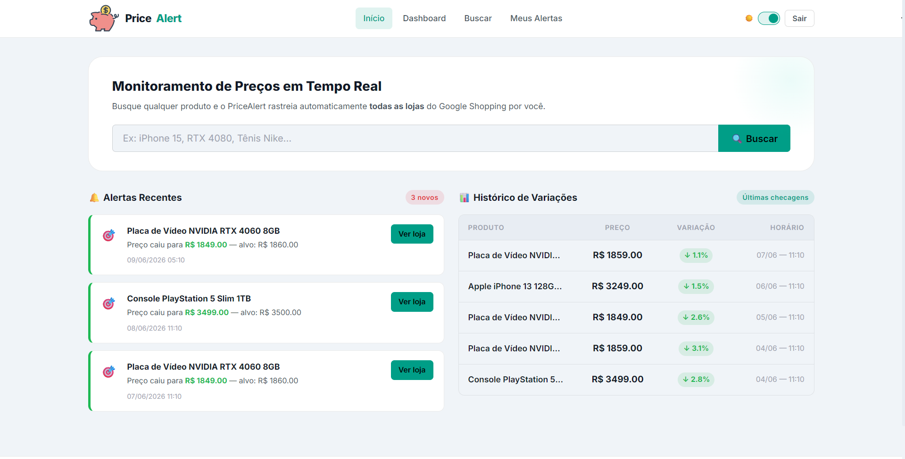
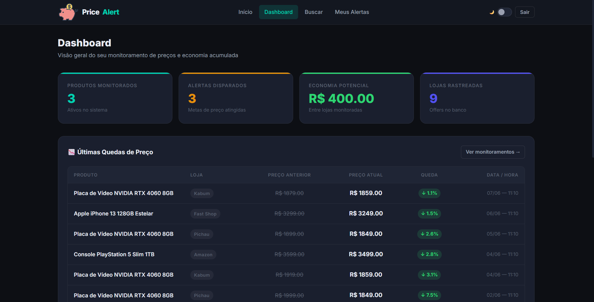

<div align="center">
  

# PriceAlert 🏷️

**Monitoramento Inteligente de Preços no Google Shopping**

  <p align="center">
    
    
    
    
    
    
  </p>

  <br>

  <a href="https://pricealert-1nn6.onrender.com/" target="_blank">
    
  </a>
  &nbsp;
  <a href="https://github.com/PabloBarcellos-0522/PriceAlert" target="_blank">
    
  </a>

<br>

<table>
  <tr>
    <td align="center">
      
      <br>
      <em>Página inicial com alertas e monitoramentos</em>
    </td>
    <td align="center">
      
      <br>
      <em>Dashboard com estatísticas e histórico</em>
    </td>
  </tr>
</table>

<br>

<i>Uma plataforma web que permite monitorar preços de produtos em tempo real e receber alertas automáticos quando o valor atingir o preço desejado.</i>

  <br>
</div>

---

## 📋 Índice

- [Visão Geral](#-visão-geral)
- [Funcionalidades](#-funcionalidades)
- [Arquitetura](#-arquitetura)
- [Stack Tecnológica](#-stack-tecnológica)
- [Destaques Técnicos](#-destaques-técnicos)
- [Como Rodar o Projeto](#-como-rodar-o-projeto)
- [Testes](#-testes)
- [Estrutura do Projeto](#-estrutura-do-projeto)
- [Contribuição](#-contribuição)
- [Autores](#-autores)
- [Licença](#-licença)

---

## 🎯 Visão Geral

**PriceAlert** é uma plataforma web full-stack que resolve um problema real do e-commerce: **a volatilidade dos preços**. Em vez de verificar manualmente dezenas de lojas todos os dias, o PriceAlert automatiza esse processo:

1. **Busca** produtos no Google Shopping via API SerpAPI
2. **Monitora** os preços em múltiplas lojas simultaneamente
3. **Notifica** o usuário por email quando o preço atinge o valor desejado
4. **Histórico** de variação de preços para análise de tendências

---

## ✨ Funcionalidades

### Para Usuários

- 🔍 **Busca Inteligente** — Pesquise qualquer produto e encontre as melhores ofertas no Google Shopping
- 📊 **Dashboard Analítico** — Acompanhe estatísticas: total monitorado, alertas recebidos, economia acumulada
- 🎯 **Alertas Personalizados** — Defina o preço alvo e seja notificado por email quando atingir
- 📈 **Histórico de Preços** — Visualize a evolução dos preços ao longo do tempo com gráficos
- 💰 **Cálculo de Economia** — Veja quanto você economizaria comparando lojas
- 👤 **Gestão de Conta** — Cadastro, login e gerenciamento de monitoramentos

### Técnicas

- ⚡ **Background Tasks** — Scanner semanal automatizado (APScheduler) para atualizar preços sem sobrecarregar a API
- 🗄️ **Cache Inteligente** — Produtos e ofertas armazenados em banco local para reduzir chamadas à API externa
- 📧 **Notificações por Email** — Email transacional com templates HTML responsivos
- 🔒 **CSRF Protection** — Segurança em todos os formulários via Flask-WTF
- 📱 **Responsivo** — Interface adaptável a qualquer dispositivo

---

## 🏛️ Arquitetura

### Design Pattern: Application Factory

O projeto segue o padrão **Application Factory** do Flask, que permite criar a aplicação sob demanda com configurações diferentes para cada ambiente:

```python
def create_app(test_config=None):
    app = Flask(__name__, instance_relative_config=True)

    # Extensões e camadas carregadas na ordem correta
    init_config(app)      # Variáveis de ambiente
    init_db(app)          # Banco de dados
    register_models()     # Modelos SQLAlchemy
    init_site(app)        # Blueprints (apresentação)
    init_services(app)    # Serviços (negócio)
    init_tasks(app)       # Tarefas agendadas

    return app
```

**Por que Application Factory?** Facilita testes com bancos isolados, permite configurações diferentes por ambiente (dev/test/prod), e mantém o código desacoplado e testável.

### Arquitetura em 3 Camadas

```
┌─────────────────────────────────────────────────────────┐
│                   CAMADA DE APRESENTAÇÃO                │
│  ┌──────────┐  ┌──────────┐  ┌──────────┐  ┌─────────┐  │
│  │ Blueprint│  │ Jinja2   │  │ Flash    │  │Forms    │  │
│  │ (Rotas)  │  │Templates │  │ Messages │  │WTForms  │  │
│  └────┬─────┘  └──────────┘  └──────────┘  └─────────┘  │
├───────┼─────────────────────────────────────────────────┤
│       ▼                                                 │
│                   CAMADA DE NEGÓCIO                     │
│  ┌──────────────────┐  ┌───────────────┐ ┌───────────┐  │
│  │ MonitoringService│  │ EmailService  │ │SerpApiSvc │  │
│  │ (Alertas)        │  │ (Notificações)│ │(Busca)    │  │
│  └────────┬─────────┘  └───────────────┘ └─────┬─────┘  │
├───────────┼────────────────────────────────────┼────────┤
│           ▼                                    ▼        │
│                   CAMADA DE DADOS                       │
│  ┌──────────────────────────────────────────────────┐   │
│  │           SQLAlchemy ORM + PostgreSQL            │   │
│  │  ┌──────┐ ┌───────┐ ┌──────┐ ┌──────────────┐    │   │
│  │  │ User │ │Product│ │Offer │ │ PriceHistory │    │   │
│  │  └──────┘ └───────┘ └──────┘ └──────────────┘    │   │
│  │  ┌──────────────────┐ ┌──────────────┐           │   │
│  │  │ProductMonitoring │ │ Notification │           │   │
│  │  └──────────────────┘ └──────────────┘           │   │
│  └──────────────────────────────────────────────────┘   │
└─────────────────────────────────────────────────────────┘
```

### Fluxo de uma Requisição Típica

```
Usuário → Rota HTTP → View (Blueprint) → Service → ORM → Database
                                              ↓
                                      SerpAPI (API externa)
                                              ↓
                                      Email Service (notificações)
```

### Background Tasks (APScheduler)

O scanner semanal roda automaticamente aos domingos às 03:00:

```
APScheduler → PriceScannerService → SerpAPI (preços)
        ↓                              ↓
  Email Notification ← MonitoringService ← PriceHistory (histórico)
```

---

## 🛠️ Stack Tecnológica

### Backend

| Tecnologia              | Versão | Aplicação no Projeto                                                               |
| ----------------------- | ------ | ---------------------------------------------------------------------------------- |
| **Python**              | 3.9+   | Linguagem principal — tipagem forte com type hints e tratamento de exceções        |
| **Flask**               | 3.x    | Framework web — Application Factory, injeção de dependência, modularidade          |
| **SQLAlchemy**          | 2.x    | ORM completo — 6 modelos com relacionamentos, cascade delete, consultas otimizadas |
| **Flask-WTF / WTForms** | —      | Formulários com validação server-side e proteção CSRF automática                   |
| **Jinja2**              | —      | Motor de templates com herança de layout e blocos modulares                        |
| **SerpAPI**             | —      | Integração com Google Shopping — parsing de resposta em múltiplos formatos         |
| **APScheduler**         | —      | Tarefas agendadas — scan semanal sem dependência de Celery                         |
| **Flask-Mail**          | —      | Email transacional — templates HTML com notificações e digest                      |
| **Gunicorn**            | —      | WSGI server para produção (Render)                                                 |

### Banco de Dados

| Ambiente        | Tecnologia            | Uso                         |
| --------------- | --------------------- | --------------------------- |
| Produção        | **PostgreSQL**        | Dados persistentes em cloud |
| Desenvolvimento | **SQLite**            | Simplicidade local          |
| Testes          | **SQLite em memória** | Isolamento total por teste  |

### Frontend

| Tecnologia            | Uso                                                       |
| --------------------- | --------------------------------------------------------- |
| **CSS Personalizado** | Design system próprio, responsivo, sem frameworks pesados |
| **Chart.js**          | Gráficos de evolução de preços no dashboard               |
| **Jinja2 Templates**  | Herança de layout, partials, context processors           |

### Infraestrutura

| Ferramenta            | Uso                                           |
| --------------------- | --------------------------------------------- |
| **Git / GitHub**      | Controle de versão, colaboração, documentação |
| **Render**            | Deploy automatizado a partir do GitHub        |
| **Invoke (tasks.py)** | Automação de comandos (run, test, seed)       |
| **pytest**            | Testes automatizados com fixtures e mocks     |

---

## 🧠 Destaques Técnicos

### 1. Sistema de Notificações Inteligente

O `MonitoringService` possui uma lógica de notificação em dois modos:

```python
# Modo 1: Preço Alvo - Notifica quando atinge o valor desejado
if monitoring.desired_price:
    if current_price <= monitoring.desired_price:
        if last_notified is None or current_price < last_notified:
            # Cria notificação e evita duplicatas

# Modo 2: Menor Preço Histórico - Notifica apenas em novos mínimos
elif monitoring.notify_only_lowest_price:
    lowest = self._get_lowest_historical_price(offer)
    if current_price < lowest:
        # Cria notificação de novo recorde
```

### 2. Integração Resiliente com SerpAPI

A integração com a API externa trata múltiplos formatos de resposta e falhas parciais:

```python
# Tratamento de diferentes formatos da API
stores = product_info.get("stores") or product_info.get("stores", [])
for store in stores:
    # Fallback de parsing de preço: numérico → textual → regex
    if store.get("extracted_price") is not None:
        price_val = store.get("extracted_price")
    elif store.get("price"):
        price_val = float(parse_price_textual(store.get("price")))
```

### 3. Scanner Semanal com Tolerância a Falhas

O scanner processa dezenas de produtos em lote sem que a falha de um interrompa os outros:

```python
for product in active_products:
    try:
        service.get_product_details(product.product_token)
    except Exception as e:
        app.logger.error(f"Falha no produto {product.id}: {e}")
        # Continua com o próximo produto

results = monitoring_service.check_all_active_monitorings()
email_service.send_notifications_batch(results)
```

### 4. Testes com Mock de API Externa

Testes utilizam `unittest.mock` para simular a SerpAPI sem consumir créditos reais:

```python
def test_search_flow(app, db, mock_serpapi_service):
    mock_serpapi_service.search.return_value = {
        "shopping_results": [{
            "product_id": "api_prod_999",
            "title": "Fone Bluetooth",
            "price": "R$ 299,00",
        }]
    }
    products = app.product_service.search("fone")
    assert len(products) == 1
    assert products[0].title == "Fone Bluetooth"
```

---

## 🚀 Como Rodar o Projeto

### Pré-requisitos

- **Python 3.9+**
- **PostgreSQL** (opcional — SQLite funciona perfeitamente para desenvolvimento)
- **Conta no [SerpAPI](https://serpapi.com/)** (plano gratuito com 100 consultas/mês)

### Passo a Passo

```bash
# 1. Clone o repositório
git clone https://github.com/PabloBarcellos-0522/PriceAlert.git
cd PriceAlert

# 2. Crie e ative o ambiente virtual
python -m venv .venv
source .venv/bin/activate      # Linux / macOS
.venv\Scripts\activate         # Windows

# 3. Instale as dependências (incluindo dev e test)
pip install -e ".[dev,test]"

# 4. Configure as variáveis de ambiente
cp .env.dev.templete .env
# Edite o arquivo .env com suas credenciais:
#   - SECRET_KEY: qualquer string aleatória
#   - SERPAPI_API_KEY: sua chave do SerpAPI
#   - Configurações de email (opcional para testar)

# 5. Inicie o servidor de desenvolvimento
invoke run

# Acesse: http://localhost:5000 🎉
```

### Comandos Úteis

| Comando        | Descrição                                       |
| -------------- | ----------------------------------------------- |
| `invoke run`   | Inicia o servidor Flask em modo desenvolvimento |
| `invoke test`  | Executa todos os testes com pytest              |
| `invoke seed`  | Popula o banco com dados iniciais de exemplo    |
| `invoke shell` | Abre um shell IPython com contexto da aplicação |

### Deploy

O projeto está configurado para deploy no **Render** com:

- **Web Service:** Gunicorn como WSGI server
- **Banco:** PostgreSQL gerenciado pelo Render
- **Build:** Instalação automática das dependências
- **Auto-deploy:** A cada push no branch `main`

---

## 🧪 Testes

O projeto possui **36+ testes automatizados** com cobertura abrangente:

### Cobertura

```
tests/
├── conftest.py        # Fixtures compartilhadas (app, db, client, mocks)
├── test_main.py       # 24 testes: modelos, serviços, rotas, API
└── test_scanner.py    # 12 testes: scanner semanal, falhas, rollback
```

### Categorias

| Categoria            | Testes | O que valida                                                 |
| -------------------- | ------ | ------------------------------------------------------------ |
| **Modelos**          | 6      | Criação, atributos, propriedades computadas, relacionamentos |
| **Serviços**         | 10     | MonitoringService, EmailService, SerpapiProductService       |
| **Rotas Públicas**   | 3      | Index, login, signup — renderização correta                  |
| **Autenticação**     | 2      | Signup com dados válidos/duplicados, login/logout            |
| **Rotas Protegidas** | 4      | Redirecionamento de anônimos, dashboard, add/remove          |
| **API**              | 3      | Histórico de preços — autorização, 404, dados corretos       |
| **Scanner**          | 8      | Fluxo completo, falhas parciais, rollback, sem produtos      |

### Como Executar

```bash
# Executar todos os testes
invoke test

# Com relatório de cobertura
pytest --cov=price tests/ --cov-report=term-missing

# Testar arquivo específico
pytest tests/test_main.py -v
```

---

## 📁 Estrutura do Projeto

```
PriceAlert/
│
├── app.py                        # Application Factory — ponto de entrada
├── tasks.py                      # Comandos CLI (invoke)
├── pyproject.toml                # Dependências e metadados do projeto
├── README.md                     # Esta documentação
│
├── price/                        # Pacote principal
│   ├── ext/                      # Extensões Flask
│   │   ├── config/               #   Carregamento de .env
│   │   ├── db/                   #   SQLAlchemy
│   │   ├── cli/                  #   Comandos personalizados
│   │   ├── wtf/                  #   CSRF Protection
│   │   └── debugtoolbar/         #   Debug toolbar (dev)
│   │
│   ├── views/                    # 🎨 Camada de Apresentação
│   │   ├── __init__.py           #   init_site() — registro do Blueprint
│   │   └── main.py               #   10 rotas (index, dashboard, login, etc.)
│   │
│   ├── services/                 # ⚙️ Camada de Negócio
│   │   ├── __init__.py           #   init_services() — injeção de dependências
│   │   ├── main_service.py       #   Lógica do dashboard e página inicial
│   │   ├── monitoring_service.py #   Criação/notificação de monitoramentos
│   │   ├── product_service.py    #   Integração com SerpAPI
│   │   ├── email_service.py      #   Envio de emails transacionais
│   │   └── pricescanner_service.py # Scanner semanal de preços
│   │
│   ├── models/                   # 🗄️ Camada de Dados
│   │   ├── user.py               #   Usuários
│   │   ├── product.py            #   Produtos (com propriedades computadas)
│   │   ├── offer.py              #   Ofertas por loja
│   │   ├── price_history.py      #   Histórico de variação de preços
│   │   ├── product_monitoring.py #   Monitoramentos ativos/inativos
│   │   └── notification.py       #   Notificações enviadas
│   │
│   ├── forms/                    # 📝 Formulários com Validação
│   │   └── main.py               #   LoginForm, SignUpForm, ContatoForm
│   │
│   └── tasks/                    # ⏰ Tarefas Agendadas
│       ├── __init__.py           #   init_tasks() + APScheduler
│       └── scanner.py            #   Lógica isolada do scanner semanal
│
├── templates/main/               # 🖌️ Templates Jinja2
│   ├── base.html                 #   Layout base com navbar e footer
│   ├── index.html                #   Página inicial
│   ├── dashboard.html            #   Dashboard do usuário
│   ├── search.html               #   Busca de produtos
│   ├── monitored.html            #   Produtos monitorados
│   ├── login.html                #   Login
│   ├── signup.html               #   Cadastro
│   └── partials/                 #   Navbar e Footer
│
├── static/                       # 📦 Arquivos Estáticos
│   ├── css/style.css             #   Design system responsivo
│   └── resources/                #   Ícones e imagens
│
├── tests/                        # 🧪 Testes Automatizados
│   ├── conftest.py               #   Fixtures (app, db, client, mocks)
│   ├── test_main.py              #   24 testes
│   └── test_scanner.py           #   12 testes
│
├── .env.*                        # Templates de configuração
└── instance/                     # Dados locais (SQLite, logs)
```

---

## 🤝 Contribuição

Contribuições são bem-vindas! Siga os passos:

1. **Fork** o projeto
2. **Crie uma branch** (`git checkout -b feature/nova-funcionalidade`)
3. **Commit** suas mudanças (`git commit -m 'Adiciona nova funcionalidade'`)
4. **Push** para a branch (`git push origin feature/nova-funcionalidade`)
5. **Abra um Pull Request**

### Guidelines

- Mantenha o padrão de **type hints** em todas as funções
- Escreva **testes** para novas funcionalidades
- Siga a estrutura de **camadas** (views → services → models)
- Use **variáveis de ambiente** para configurações sensíveis

---

## 👥 Autores

<table>
  <tr>
    <td align="center">
      <a href="https://github.com/PabloBarcellos-0522">
        <br>
        <b>Pablo Barcellos</b>
      </a>
    </td>
    <td align="center">
      <a href="https://github.com/Teo-Giambarba">
        <br>
        <b>Teo Giambarba</b>
      </a>
    </td>
  </tr>
</table>

---

## 📄 Licença

Este projeto está sob a licença MIT. Veja o arquivo [LICENSE](LICENSE) para mais detalhes.

---

<div align="center">
  <br>
  <p>
    <strong>PriceAlert</strong> — Projeto desenvolvido como parte da disciplina de Desenvolvimento Web.
  </p>
  <p>
    <a href="https://pricealert-1nn6.onrender.com/" target="_blank">🌐 Acesse o site</a>
    &nbsp;·&nbsp;
    <a href="https://github.com/PabloBarcellos-0522/PriceAlert/issues" target="_blank">🐛 Reportar bug</a>
    &nbsp;·&nbsp;
    <a href="https://github.com/PabloBarcellos-0522/PriceAlert/discussions" target="_blank">💬 Discussões</a>
  </p>
  <br>
</div>
